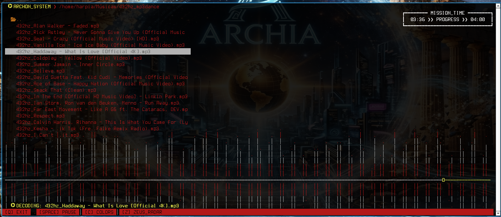
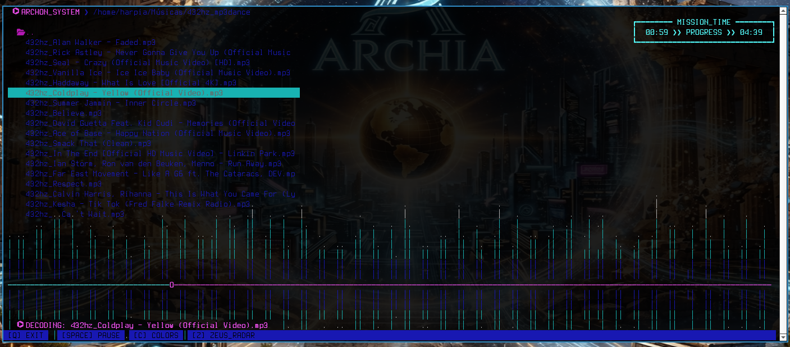
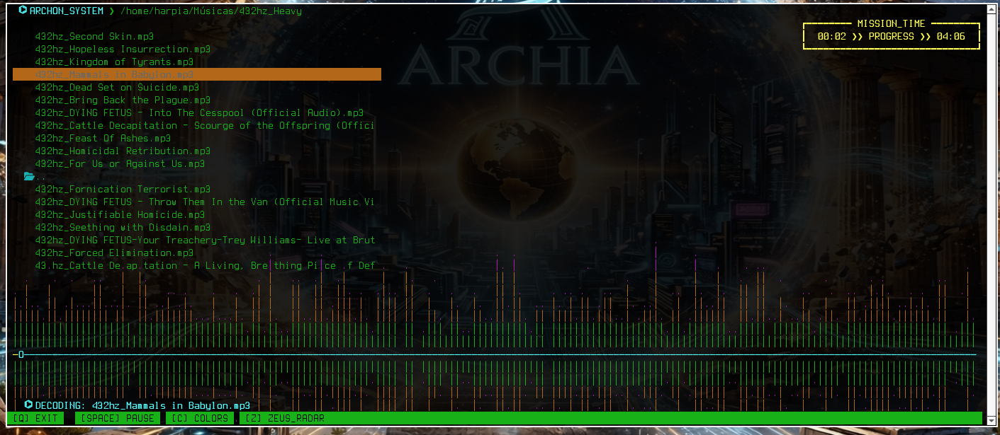

# 🎧 ArchonPlayer-TUI

O **ArchonPlayer** é um tocador de música para terminal focado em estética cyberpunk e performance. Ele traz um espectro de áudio dinâmico e temas customizáveis para uma experiência única no terminal.

## ✨ Diferenciais
*   **Visual:** Espectro de áudio em tempo real.
*   **Navegação:** Explore pastas e arquivos diretamente.
*   **Personalização:** Temas Red, Blue e Green inclusos.
*   **Leveza:** Interface TUI otimizada.

## 📸 Temas Disponíveis


| **Archon Red** | **Archon Blue** | **Archon Green** |
| :---: | :---: | :---: |
|  |  |  |

## 🚀 Como Compilar e Rodar

Requer: `SDL2`, `SDL2_mixer` e `ncurses`.

```bash
# 1. Entre na pasta
cd archonplayer

# 2. Compile (Forjado no Olimpo!)
make

# 3. Rode o player
./bin/archonplayer
```

*(Opcional) Para instalar no sistema:* `sudo make install`

## ⚖️ Licença
Este projeto está sob a licença **MIT**.

---
*Desenvolvido por luiskallak-design*

